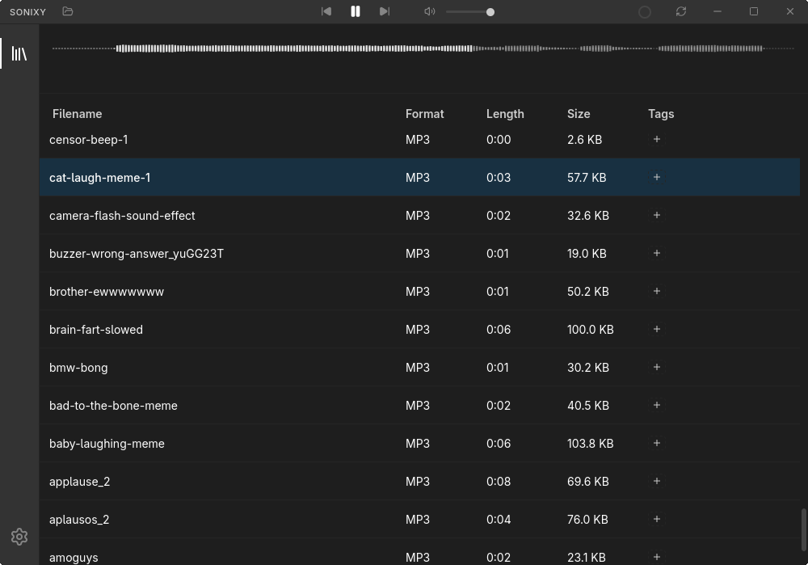

<div align="center">
  
  <h1>Sonixy</h1>
  <p>A modern, lightweight audio library manager and player built for performance and precision.</p>
</div>

<p align="center">
  
</p>

Sonixy is a high-performance desktop application designed for audio enthusiasts and creators who need a fast, reliable way to manage and audition their audio collections. Built with **Tauri**, **Svelte 5**, and **Rust**, it combines the speed of native code with a refined, modern user interface.

## Getting Started

### Prerequisites

To run or build Sonixy, you'll need the following installed:

- [Rust](https://www.rust-lang.org/tools/install) (latest stable)
- [Node.js](https://nodejs.org/) (v18+)
- [pnpm](https://pnpm.io/)
- [FFmpeg](https://ffmpeg.org/) (required for normalization and trimming features)

### Installation

1. **Clone the repository**:
   ```bash
   git clone https://codeberg.org/sker/sonixy.git
   cd sonixy
   ```

2. **Install dependencies**:
   ```bash
   pnpm install
   ```

3. **Run in development mode**:
   ```bash
   pnpm tauri dev
   ```

## Development

### Available Scripts

- `pnpm dev`: Starts the Vite development server.
- `pnpm build`: Builds the frontend for production.
- `pnpm tauri dev`: Starts the Tauri app in development mode.
- `pnpm tauri build`: Builds the production-ready desktop application.
- `pnpm lint`: Runs ESLint, Prettier, and Cargo Clippy checks.
- `pnpm format`: Formats both frontend and Rust code.